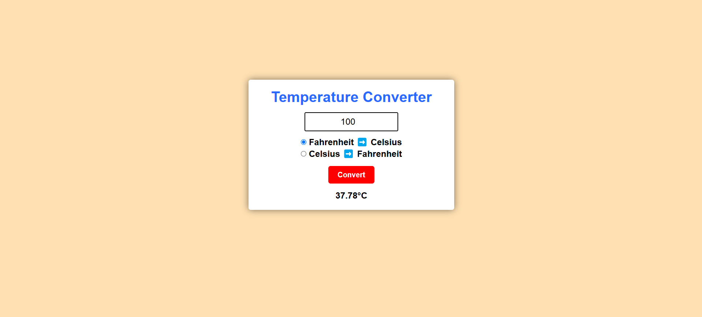

# 🌡️ Temperature Converter

A simple web-based application that converts temperatures between Celsius and Fahrenheit.

## 🔧 Features

- Convert Fahrenheit to Celsius
- Convert Celsius to Fahrenheit
- Input validation with user-friendly error messages

## 🖥️ Tech Stack

- HTML5
- CSS3
- JavaScript (Vanilla)

## 📸 Preview

